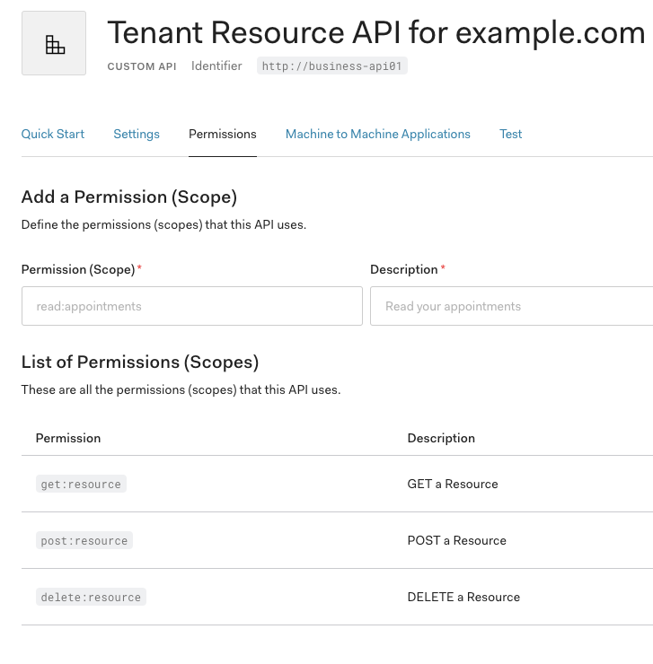

# Inside Auth0

## Part Played By Auth0

1. Auth0 authenticates the user
   - This part is not included in the repo (yet).
   - Any of the Auth0 Login samples can be referred to for this.
  
2. Auth0 executes the Rule Pipeline (see [rule.js](rule.js)) to perform `Coarse Grained Authorization (CGA)`.
   - The rule enforces MFA if the client app requests `delete:resource` scope.
   - The rule also decorates the `access_token` with claim `http://example.com/authn_loa` with the value `2` if MFA was performed.
   - The app then uses the `access_token` to make an API call (see [access_token.sample](access_token.sample)).

## API definition on Auth0

The API on Auth0 looks like the following

